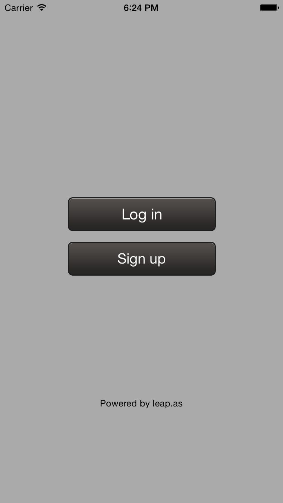
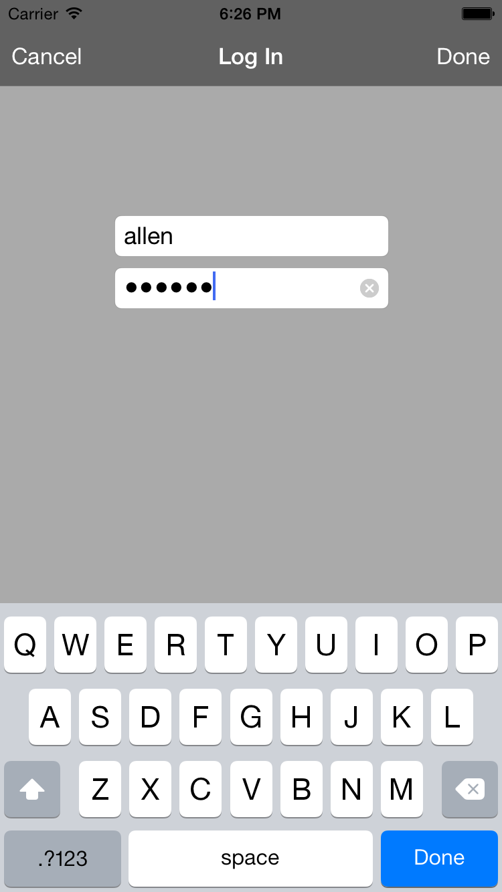
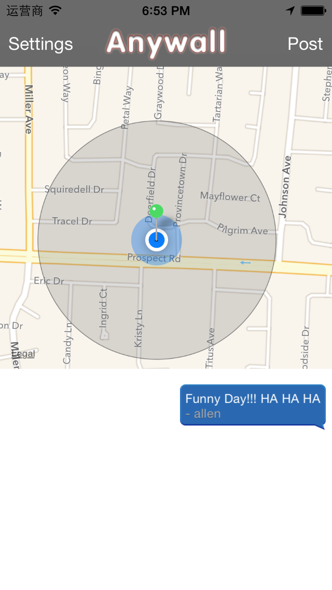

# AnyWall

## Overview

This is a location-aware app based on Leap App Services.

## Features

- User sign up and sign in
- Post with current location
- LASGeoPoint
- Search LASGeoPoints

## Screenshots

## How to Run

- Clone the repository and open the project.
- Create an app in leap.as console and name it LAS App. You can skip this step if you've already created one.
- Add your applicationID and clientKey of LAS App in `AppDelegate.`.
- Press Command + R to run it.

## Learn More

Please check official [LAS iOS Guide](https://leap.as/docs/cloudData/ios.html#GeoPoints) to learn more details.
